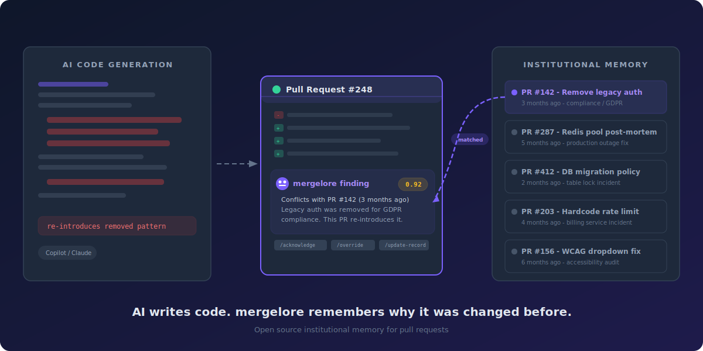
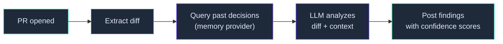

<p align="center">
  
</p>

<h1 align="center">mergelore</h1>

<p align="center"><strong>Give your PRs the institutional memory that AI-generated code lacks.</strong></p>

<p align="center">
  <a href="https://github.com/automationpi/mergelore/actions/workflows/ci.yml"></a>
  <a href="https://github.com/automationpi/mergelore/releases"></a>
  <a href="https://github.com/automationpi/mergelore/blob/main/LICENSE"></a>
  <a href="https://hub.docker.com/r/automationpi/mergelore-action"></a>
  <a href="https://ghcr.io/automationpi/mergelore-action"></a>
</p>

<p align="center">
  
</p>

mergelore is a GitHub Action that reviews pull requests against your team's history. When a PR re-introduces a pattern you already removed, reverses an architectural decision, or violates a constraint that was load-tested and hardcoded - mergelore flags it before it ships.

## The problem

AI coding tools (Claude Code, Copilot, Cursor, Codex) generate code that looks correct in isolation. But they have zero awareness of your team's history -the decisions made in past PRs, the patterns deliberately removed, the limits that were hardcoded for a reason.

Every existing review tool analyzes the **present diff**. None of them remember *why* past decisions were made.

mergelore bridges that gap.

## How it works



mergelore runs entirely in your CI pipeline. No data leaves your GitHub Actions runner except API calls to the LLM provider you choose.

### What it catches

When a PR conflicts with a past decision, mergelore posts a finding directly on the PR with a confidence score, a plain-language explanation of what was decided before, and a link to the original PR. Every finding includes slash commands so the author can acknowledge, override with a reason, or mark the current PR as the new decision.

Here are real scenarios that happen in every growing codebase:

---

**Backend: Connection pool limit re-introduced after outage**

A new engineer adds a Redis connection pool with `maxConnections: 100`. Looks reasonable. But three months ago, your team debugged a production outage caused by exactly that - Redis was exhausting file descriptors at 100 connections. PR #287 reduced it to 20 with a detailed post-mortem.

```
Connection pool limit conflicts with post-mortem decision - confidence: 0.92
> PR #287 reduced Redis maxConnections from 100 to 20 after a production
> outage where the pool exhausted file descriptors under load. The post-mortem
> explicitly recommended keeping this value low.
> This PR sets maxConnections back to 100, directly reversing that decision.
> Source: PR #287 - 2025-11-14
```

---

**Frontend: Removed accessibility pattern brought back**

Copilot generates a custom dropdown using `<div onClick>`. Clean code, works fine. But your team spent two sprints replacing every custom dropdown with `<select>` and ARIA attributes after a WCAG audit. PR #156 documented the policy.

```
Custom dropdown conflicts with accessibility policy - confidence: 0.88
> PR #156 replaced all custom div-based dropdowns with native <select>
> elements and ARIA roles to meet WCAG 2.1 AA compliance. The review
> comments note that custom dropdowns failed screen reader testing.
> This PR introduces a new div-based dropdown component in UserSettings.
> Source: PR #156 - 2025-08-22
```

---

**Database: Migration pattern that already caused downtime**

A PR adds `ALTER TABLE users ADD COLUMN preferences JSONB DEFAULT '{}'`. Looks standard. But PR #412 tried the same thing and was reverted - adding a default value on a 50M row table locked it for 8 minutes in production.

```
Column default on large table conflicts with migration policy - confidence: 0.90
> PR #412 attempted to add a JSONB column with a DEFAULT value to the users
> table (50M+ rows). The migration locked the table for 8 minutes in production.
> PR #415 documented the policy: large tables must use ADD COLUMN without
> DEFAULT, then backfill in batches.
> This PR adds a DEFAULT value to the same table.
> Source: PR #415 - 2026-01-05
```

---

**API: Rate limit deliberately hardcoded after incident**

Claude Code generates an API endpoint with configurable rate limiting via environment variable. Flexible, good practice - normally. But your team hardcoded the rate limit to 100 req/s after an incident where a misconfigured env var allowed 10,000 req/s and took down the billing service.

```
Configurable rate limit conflicts with hardcoding decision - confidence: 0.85
> PR #203 hardcoded the API rate limit to 100 req/s after an incident where
> a misconfigured RATE_LIMIT env var allowed 10,000 req/s and overwhelmed
> the downstream billing service. The PR review explicitly decided against
> making this configurable.
> This PR makes the rate limit configurable via environment variable.
> Source: PR #203 - 2025-09-30
```

---

Your reviewers are good. But they're reviewing 3x more PRs than last year - most of them AI-generated - across dozens of files they didn't write. No human can hold six months of architectural decisions in their head while reviewing their 12th PR of the day.

mergelore doesn't replace your reviewers. It gives them the context they'd have if they personally reviewed every PR in the repo's history. The reviewer focuses on code quality. mergelore watches for decisions being silently undone.

Findings are **suggestions, not blocks** - unless you explicitly opt into `block-on-critical`.

> See the [full quickstart guide](https://gist.github.com/automationpi/2160dd02ea6b4628e7658fcb4bd816e5) for detailed setup instructions, architecture deep-dive, and more examples.

## Quickstart

Add this to `.github/workflows/mergelore.yml`:

```yaml
name: mergelore
on:
  pull_request:
    types: [opened, synchronize, reopened]
  issue_comment:
    types: [created]

permissions:
  pull-requests: write
  contents: read

jobs:
  review:
    runs-on: ubuntu-latest
    steps:
      - uses: actions/checkout@v4
      - uses: automationpi/mergelore/action@v0.2.0
        with:
          anthropic-api-key: ${{ secrets.ANTHROPIC_API_KEY }}
```

That's it. Add your `ANTHROPIC_API_KEY` as a repo secret and every PR gets reviewed.

## Configuration

| Input | Default | Description |
|-------|---------|-------------|
| `anthropic-api-key` | -| Anthropic API key (required for `claude` provider) |
| `openai-api-key` | -| OpenAI API key (required for `openai` provider) |
| `llm-provider` | `claude` | LLM to use for analysis: `claude` or `openai` |
| `memory-provider` | `git-native` | How to retrieve past decisions: `none` or `git-native` |
| `history-depth` | `20` | Number of past merged PRs to search |
| `confidence-threshold` | `0.7` | Minimum confidence (0.0-1.0) to post a finding |
| `block-on-critical` | `false` | Fail CI on critical findings |
| `timeout` | `45000` | Timeout in ms for LLM and memory queries |

### Using OpenAI instead of Claude

```yaml
- uses: automationpi/mergelore/action@v0.2.0
  with:
    llm-provider: openai
    openai-api-key: ${{ secrets.OPENAI_API_KEY }}
```

### Diff-only mode (no history)

If you just want LLM-powered diff review without historical context:

```yaml
- uses: automationpi/mergelore/action@v0.2.0
  with:
    anthropic-api-key: ${{ secrets.ANTHROPIC_API_KEY }}
    memory-provider: none
```

### Blocking on critical findings

```yaml
- uses: automationpi/mergelore/action@v0.2.0
  with:
    anthropic-api-key: ${{ secrets.ANTHROPIC_API_KEY }}
    block-on-critical: true
```

## Memory providers

mergelore has a plugin architecture. You pick how it remembers your team's decisions.

### `none` -No memory (Tier 0)

The LLM reviews the diff on its own merits. No historical context. Good for trying mergelore out or small repos where past decisions are few.

### `git-native` -GitHub API (Tier 1, default)

Fetches your repo's recently merged PRs via the GitHub API. Scores them by file overlap with the current diff and sends the most relevant ones as context to the LLM. No extra infrastructure needed -it uses the `GITHUB_TOKEN` already available in Actions.

This is the sweet spot for most teams.

### `qdrant` -Vector search (Tier 2)

Search over your full indexed PR history using Qdrant. The separate **indexer** service embeds merged PRs into Qdrant after each merge. The action queries Qdrant by file path overlap -no embedding runs in CI.

**Step 1:** Add the indexer workflow (runs on merge to main):

```yaml
name: mergelore-index
on:
  push:
    branches: [main]
permissions:
  contents: read
  pull-requests: read
jobs:
  index:
    runs-on: ubuntu-latest
    steps:
      - uses: automationpi/mergelore/indexer@v0.2.0
        with:
          qdrant-url: ${{ secrets.QDRANT_URL }}
        env:
          GITHUB_TOKEN: ${{ secrets.GITHUB_TOKEN }}
          OPENAI_API_KEY: ${{ secrets.OPENAI_API_KEY }}
          QDRANT_API_KEY: ${{ secrets.QDRANT_API_KEY }}
```

**Step 2:** Update your mergelore review workflow:

```yaml
- uses: automationpi/mergelore@v0.2.0
  with:
    anthropic-api-key: ${{ secrets.ANTHROPIC_API_KEY }}
    memory-provider: qdrant
    vector-store-url: ${{ secrets.QDRANT_URL }}
  env:
    QDRANT_API_KEY: ${{ secrets.QDRANT_API_KEY }}
```

If Qdrant is unreachable, mergelore automatically falls back to `git-native` with a warning.

#### Supported embedding models

| Model | Provider | Dimensions | Cost |
|-------|----------|-----------|------|
| `text-embedding-3-small` | OpenAI | 1536 | Low |
| `nomic-embed-text` | Local (CPU) | 768 | Free |
| `embed-english-v3.0` | Cohere | 1024 | Low |

Set via the `embed-model` input on the indexer action (default: `text-embedding-3-small`).

#### Image signing

All release images are signed with cosign keyless signing (Sigstore). Verify with:

```bash
cosign verify ghcr.io/automationpi/mergelore-action:v0.2.0
cosign verify ghcr.io/automationpi/mergelore-indexer:v0.2.0
```

## Human-in-the-loop

mergelore is an advisory tool, not an autonomous blocker. Every finding comes with slash commands:

| Command | What it does |
|---------|-------------|
| `/mergelore-acknowledge` | "I saw this, I understand, continuing anyway" |
| `/mergelore-override [reason]` | "I disagree -here's why" (reason is stored as a decision record) |
| `/mergelore-update-record` | "This PR IS the new decision -update the memory after merge" |

**Override decisions are written back as data.** When someone overrides a finding with a reason, that reason becomes part of the institutional memory. Over time, mergelore learns what your team's actual standards are.

## Architecture

```
action/
  src/
    index.ts                    # Main runner -thin orchestrator
    types.ts                    # Shared types (Diff, Context, Finding)
    diff.ts                     # PR diff extraction via GitHub API
    comment.ts                  # PR comment formatter (locked format)
    config.ts                   # Action input parser + validation
    logger.ts                   # Structured JSON logging
    handlers/
      slash-commands.ts         # HITL command handler
    providers/
      llm/
        prompts.ts              # Shared prompts + Finding schema
        claude.ts               # Anthropic API (structured via tool_use)
        openai.ts               # OpenAI API (structured via json_schema)
        factory.ts              # Provider factory
      memory/
        none.ts                 # Tier 0: no memory
        git-native.ts           # Tier 1: GitHub API
        qdrant.ts               # Tier 2: Qdrant vector store
        factory.ts              # Provider factory
indexer/                          # Async embedding service (Python 3.12)
  src/mergelore_indexer/
    main.py                       # CLI entry point
    extract.py                    # PR content extraction
    chunk.py                      # 512-token chunking with 64-token overlap
    embed/                        # Pluggable embedding providers
      openai_embed.py             # text-embedding-3-small
      nomic.py                    # nomic-embed-text (local)
      cohere_embed.py             # embed-english-v3.0
    store/
      qdrant_store.py             # Qdrant client wrapper
```

### Plugin interfaces

Everything plugs into two interfaces:

```typescript
interface LLMProvider {
  analyze(diff: Diff, context: Context[]): Promise<Finding[]>
}

interface MemoryProvider {
  index(pr: MergedPR): Promise<void>
  query(diff: Diff): Promise<Context[]>
}
```

Adding a new LLM or memory provider means implementing one interface and adding a case to the factory. That's it.

### Design principles

- **All LLM calls use structured output.** No free text parsing. Claude uses `tool_use`, OpenAI uses `json_schema`.
- **Confidence scores are mandatory.** Every finding has a score between 0.0 and 1.0. Below the threshold, it doesn't get posted.
- **Providers are stateless.** No singleton state, no class-level caching. Every invocation is independent.
- **Graceful degradation everywhere.** If the LLM API is down, mergelore posts a warning -it never breaks your CI.
- **Findings are suggestions.** mergelore never blocks a PR unless you explicitly set `block-on-critical: true`.

## Where your data lives

> **mergelore never stores your code on any third-party server.**

| Tier | Data location | Who controls it |
|------|--------------|-----------------|
| Tier 0/1 (git-native) | No storage - queries GitHub API on the fly | GitHub (your existing infra) |
| Tier 2 (Qdrant Cloud) | Your Qdrant Cloud cluster | You (free 1GB tier available) |
| Tier 2 (self-hosted) | Your own Qdrant via Docker or Kubernetes | You (fully air-gapped) |

- The action runs entirely on your GitHub Actions runner. The only external calls are to the LLM provider (Claude or OpenAI) for analysis.
- The indexer writes embeddings to your Qdrant instance. No data passes through mergelore's infrastructure. There is no mergelore backend.
- No telemetry. No call-home. No usage tracking. MIT licensed, fully auditable.
- For regulated industries (pharma, finance, healthcare): self-host Qdrant in your own VPC, use `nomic-embed-text` for local CPU embedding (no API calls), and every byte stays inside your network.

## Development

```bash
cd action
npm install
npm run typecheck    # TypeScript strict mode
npm test             # 41 unit tests
npm run build        # esbuild single-file bundle → dist/index.js
```

### Running tests

```bash
npm test                    # unit tests only
npm run test:integration    # integration tests (needs API keys)
```

### Docker

```bash
docker build -t mergelore/action action/
docker images mergelore/action --format '{{.Size}}'  # target: <50MB
```

## Roadmap

| Version | What ships |
|---------|-----------|
| v0.1.0 | Core action, Claude + OpenAI providers, git-native memory, HITL slash commands |
| **v0.2.0** | Qdrant memory provider, Python indexer, Trivy scanning, cosign image signing |
| v0.3.0 | Helm chart, webhook receiver, pgvector support |

## License

MIT
